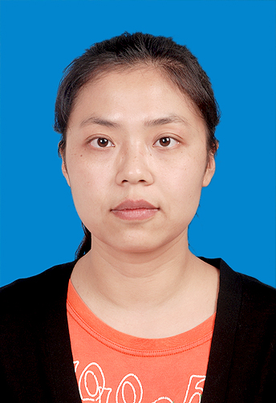
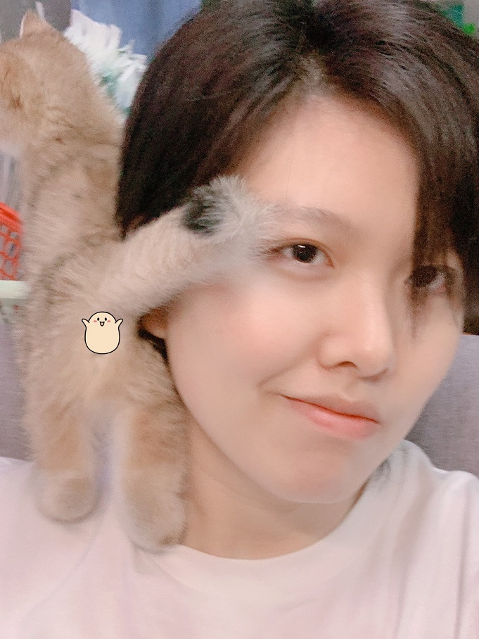
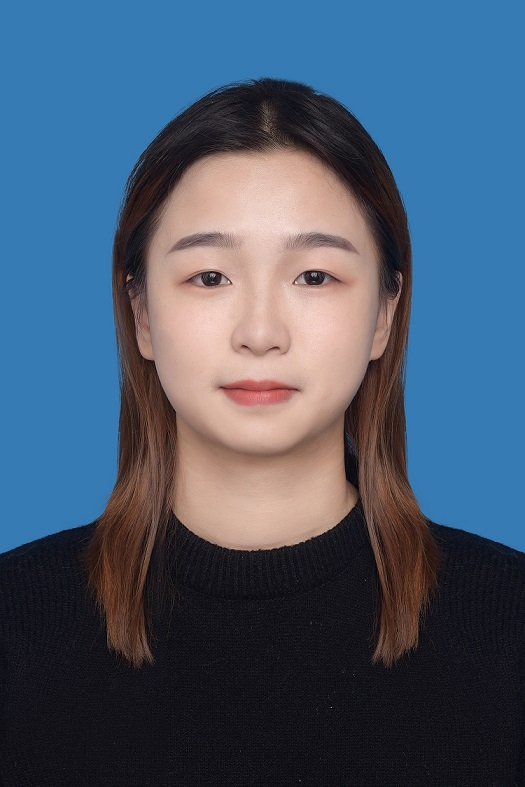
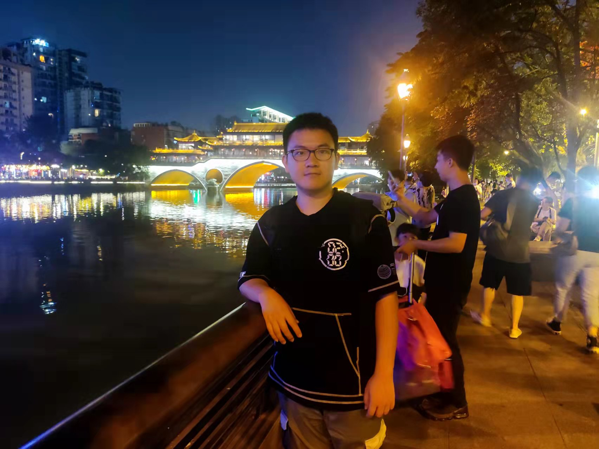
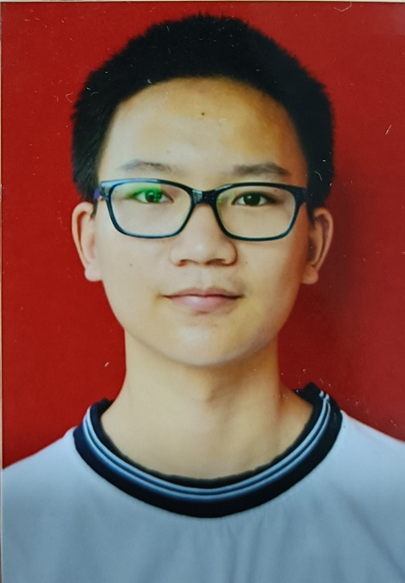
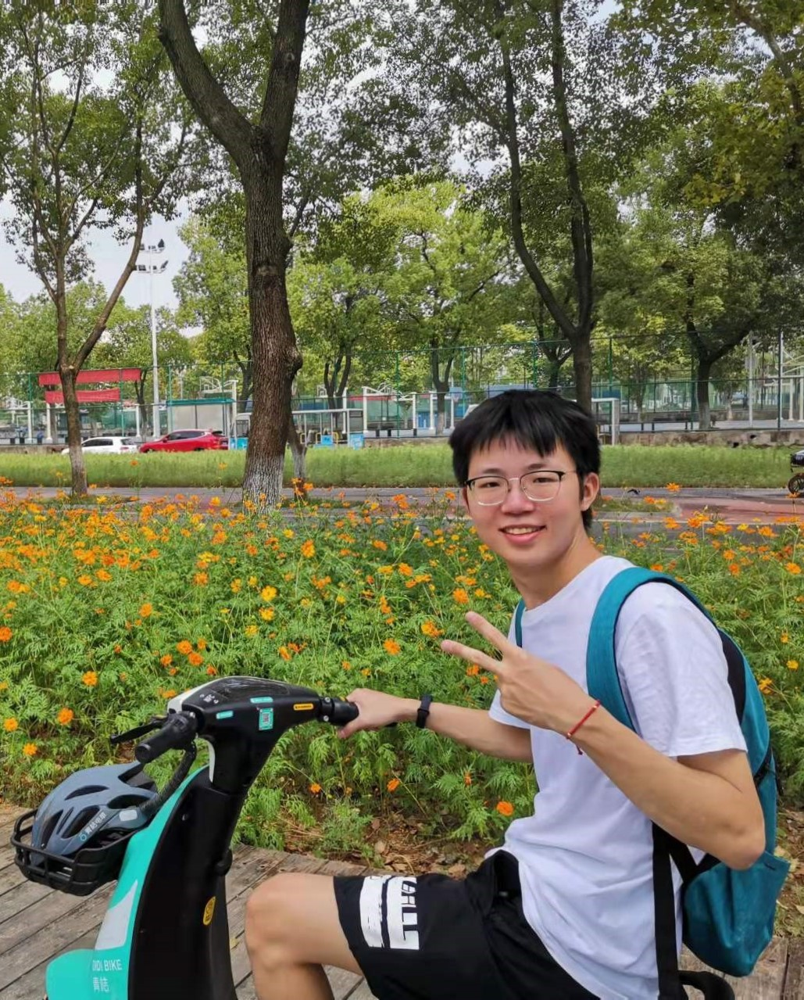

## Teacher

<table class="memberTable" border="0" width="100%" align="center">
        <tbody>
            <tr>
                <td>
                    

                </td>
                <td>
                    

                </td>
            </tr>
            <tr>
                <td>
                    

                        <a href="http://faculty.hust.edu.cn/dfeng/en/index.htm">Dan Feng </a>
                        <a href="https://scholar.google.com.hk/citations?hl=zh-CN&user=g57OG4QAAAAJ">[Google Scholar]</a>
                    

                </td>
                <td>
                    

                        <a href="http://faculty.hust.edu.cn/tongwei/zh_CN/index.htm">Wei Tong </a>
                        <a href="https://scholar.google.com/citations?user=fq-Go0sAAAAJ&hl=zh-CN">[Google Scholar]</a>
                    

                </td>                
            </tr>
        </tbody>
</table>

## Postdoc

             <a href="https://ieeexplore.ieee.org/author/37086250505">Chengning Wang</a> 

## PhD Students

### In Lab
#### SSS Group

<table class="memberTable" border="0" width="100%" align="center">
        <tbody>
            <tr>
                <td>
                    

                </td>
                <td>
                    

                </td>
                <td>
                    

                </td>
            </tr>
            <tr>
                <td>
                    

                        <a href="https://ieeexplore.ieee.org/author/37086029868">Bing Wu</a>
                    

                </td>
                <td>
                    

                        <a href="https://ieeexplore.ieee.org/author/37086938196">Xueliang Wei</a>
                    

                </td>
                <td>
                    

                        <a href="https://ieeexplore.ieee.org/author/37086836859">Hongwei Qin</a>
                    

                </td>                 
            </tr>
            <tr>
                <td>
                    

                </td>
                <td>
                    

                </td>
                <td>
                    

                </td>
            </tr>
            <tr>
                <td>
                    

                        <a href="https://thiszw.top/">Wei Zhao</a>
                    

                </td>   
                <td>
                    

                        
Tianqi Zhan

                    

                </td>
                <td>
                    

                        
Heng Zhou

                    

                </td>                   
            </tr>
            <tr>
                <td>
                    

                </td>
                <td>
                    

                </td>
                 <td>
                    

                </td>
            </tr>
            <tr>
                <td>
                    

                        
Huan Cheng

                    

                </td>
                <td>
                    

                        
Weilin Zhu

                    

                </td> 
                <td>
                    

                        
Bo Ding

                    

                </td>                   
            </tr>
            <tr>
                <td>
                    

                </td>
                <td>
                    

                </td>
                <td>
                    

                </td>                
            </tr>
            <tr>
                <td>
                    

                        
Jinpeng Liu

                    

                </td>   
                <td>
                    

                        <a href="https://gitee.com/twelvecat">Xu Jiang</a>
                    

                </td>
                <td>
                    

                        <a href="https://github.com/NickLee2050">Shuhan Li</a>
                    

                </td>                            
            </tr>
            <tr>
                <td>
                    

                </td>
				<td>
                    

                </td>
                <td>
                    

                </td>
            </tr>
            <tr>
                <td>
                    

                        
Yibo Liu

                    

                </td>   
                 <td>
                    

                        
Yu Chen

                    

                </td>
                <td>
                    

                        <a href="https://yujinyu.site">Jinyu Yu</a>
                    

                </td>  
            </tr>                        
        </tbody>
</table>

### Graduated

| **2021** |                  |
| -------- | ---------------- |
| 汪承宁   | 华中科技大学     |
| **2020** |                  |
| 徐洁     | 华为技术有限公司 |
| **2019** |                  |
| 张扬     | 华为技术有限公司 |
| 冯雅植   | 华为技术有限公司 |
| **2018** |                  |
| 李铮     | 华为技术有限公司 |
| 张建权   | 湖北科技大学     |

## Master Students

### In Lab

<table class="memberTable" border="0" width="100%">
        <tbody>
            <tr>
                <td>
                    

                </td>
                <td>
                    

                </td>
                <td>
                    

                </td>
            </tr>
            <tr>
                <td>
                    

                        
Denghui Wu

                    

                </td>
                <td>
                    

                        
Peihao Li

                    

                </td>
                <td>
                    

                        
Tianran Xiao

                    

                </td>                 
            </tr>
            <tr>
                <td>
                    

                </td>
                <td>
                    

                </td>
                <td>
                    

                </td>
            </tr>
            <tr>
                <td>
                    

                        
Minghao Yang

                    

                </td>   
                <td>
                    

                        <a href="https://gasolly.github.io/">Xufei Pan</a>
                    

                </td>
                <td>
                    

                        
Hujun Ge

                    

                </td>                   
            </tr>
            <tr>
                <td>
                    

                </td>
                 <td>
                    

                </td>
                 <td>
                    

                </td>                
            </tr>
            <tr>
                <td>
                    

                        
Zuoxian Zhang

                    

                </td>
                <td>
                    

                        
Kunhua Mo

                    

                </td>  
                <td>
                    

                        <a href="https://github.com/qzylalala">Zhongyu Qin</a>
                    

                </td>               
            </tr>       
            <tr>
                <td>
                    

                </td> 
                <td>
                    

                </td>
                <td>
                    

                </td>                                
            </tr> 
            <tr>
                <td>
                    

                        <a href ="https://github.com/JINGE-ui">Yuan Xia</a>
                    

                </td>  
                <td>
                    

                        
Run Wan

                    

                </td>
                <td>
                    

                        
Hongjie Luo

                    

                </td>                               
            </tr>                   
            <tr>
                <td>
                    

                </td>
                <td>
                    

                </td>
                <td>
                    

                </td>
            </tr>
            <tr>
                <td>
                    

                        
Mengran Zhang

                    

                </td>   
               <td>
                    

                        
Xiao Luo

                    

                </td>
                <td>
                    

                        <a href="https://github.com/PancrasL">Pengze lyu</a>
                    

                </td> 
            </tr>            
            <tr>
                <td>
                    

                </td>
                <td>
                    

                </td>
            </tr>
            <tr>
                <td>
                    

                        
Biyong Liu

                    

                </td>   
                <td>
                    

                        
Qiankun Liu

                    

                </td>              
            </tr>
        </tbody>
</table>

### Graduated

| **2021** |                                |
| -------- | ------------------------------ |
| 赵子威   | 腾讯科技(深圳)有限公司         |
| 熊宇飞   | 深圳今日头条科技有限公司       |
| 王子轲   | 汉海信息技术(上海)有限公司     |
| 秦俊青   | 华为技术有限公司武汉研究所     |
| 杨洁     | 英特尔亚太研发有限公司         |
| 刘启念   | 阿里巴巴                       |
| 唐凯     | 华为技术有限公司               |
| **2020** |                                |
| 常嘉怡   | 英特尔亚太研发有限公司         |
| 陈劲龙   | 上海华为技术有限公司           |
| 王先鹏   | 华为技术有限公司武汉研究所     |
| 邓竣中   | 腾讯科技(深圳)有限公司         |
| 彭梦烨   | 阿里巴巴                       |
| 赵雨桐   | 华为技术有限公司               |
| **2019** |                                |
| 姜越     | 英特尔亚太研发有限公司         |
| 严康     | 浙江天猫技术有限公司           |
| 谢乘胜   | 浙江天猫技术有限公司           |
| 郭甜     | 百度在线网络技术(北京)有限公司 |
| 李帅     | 河南电力公司                   |
| 杨明顺   | 百度                           |
| **2018** |                                |
| 孙博     | 浙江天猫技术有限公司           |
| 雷霞     | 腾讯科技(深圳)有限公司         |
| 马骏     | 腾讯科技(深圳)有限公司         |
| 刘翔     | 腾讯科技(深圳)有限公司         |
| **2017** |                                |
| 徐海娟   | 华为技术有限公司               |
| 张迪青   | 河南省滑县人力资源和社会保障局 |
| 宋俊辉   | 华为技术有限公司               |
| **2016** |                                |
| 刘珂男   | 浙江天猫技术有限公司           |
| 尹武哲   | 腾讯科技（深圳）有限公司       |
| **2014**     |                                |
| 龚博文   | 华为技术有限公司上海研究所     |
| 刘敏     | 华为技术有限公司上海研究所     |
